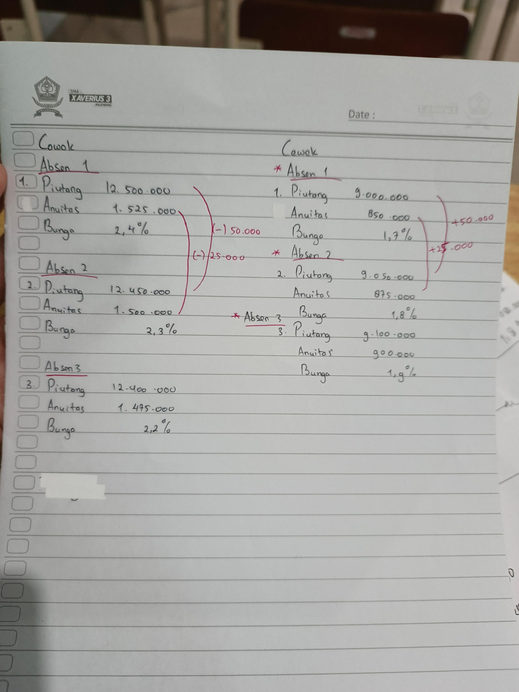
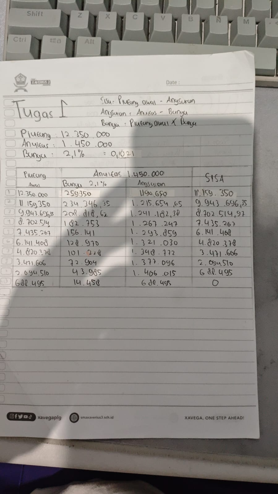

# tugas-bungamajemuk-butri-SMAXAVERIUS3PALEMBANG

untuk warga xavega

# 📊 Tugas Bunga Majemuk

> **SMA Xaverius 3 Palembang** · Matematika Kelas XI Semester 2
> 📅 Tanggal: 5 Oktober 2025
> ✅ Nilai: **Sempurna** — diraih oleh saya dan 5 teman saya 😏😏😏
> Notes: Outputnya bisa kirim ke CGPT/CLAUDE/GROK agar outputnya berubah menjadi tabel dan lebih mudah dilihat 🤫 + 🧠

---

## 🏫 Informasi Tugas

| Keterangan     | Detail                   |
| -------------- | ------------------------ |
| Sekolah        | SMA Xaverius 3 Palembang |
| Mata Pelajaran | Matematika               |
| Kelas          | XI (11) Semester 2       |
| Materi         | Bunga Majemuk            |
| Tanggal        | 5 Oktober 2025           |
| Hasil          | ★ Nilai Sempurna         |

---

## 📖 Tentang Materi

**Bunga Majemuk** adalah bunga yang dihitung secara berkala atas pokok pinjaman (piutang) **beserta bunga yang sudah terkumpul** dari periode sebelumnya. Berbeda dengan bunga tunggal yang hanya dihitung dari pokok awal, bunga majemuk menyebabkan angsuran pokok semakin besar setiap periodenya karena bunga yang dibayar semakin kecil.

Materi ini termasuk dalam topik **Matematika Keuangan** yang dipelajari di Kelas XI Semester 2.

---

## 🔢 Rumus & Konsep Utama

```
Sisa Piutang  = Piutang Awal  −  Angsuran (Pokok)
Angsuran      = Anuitas       −  Bunga
Bunga         = Piutang Awal  ×  % Bunga
```

---

## 📸 Foto Tugas Asli

### Gambar 1 — Data Piutang (Cowok & Cewek, Absen 1–3)



> Catatan kelas berisi data piutang untuk kelompok Cowok dan Cewek
> masing-masing dengan 3 absensi (Absen 1, 2, 3) beserta nilai Piutang, Anuitas, dan % Bunga.

---

### Gambar 2 — Tugas I (Tabel Angsuran)



> Tabel angsuran lengkap Tugas I dengan Piutang Rp 12.350.000,
> Anuitas Rp 1.450.000, dan Bunga 2,1% per periode.

---

## 📝 Contoh Cara Pengerjaan

> ⚠️ **Disclaimer:** Contoh pengerjaan di bawah ini adalah **rekonstruksi** karena kertas asli sudah hilang. Angka-angka mungkin tidak identik dengan pekerjaan asli, namun **metode dan langkah-langkahnya sama persis**. Meskipun demikian, tugas ini berhasil mendapat **nilai sempurna**.

### Data Soal (Tugas I)

| Data              | Nilai         |
| ----------------- | ------------- |
| Piutang Awal      | Rp 12.350.000 |
| Anuitas           | Rp 1.450.000  |
| Bunga per Periode | 2,1% = 0,021  |

### Langkah Pengerjaan

**Rumus yang digunakan:**

- `Bunga = Piutang Awal × 0,021`
- `Angsuran (Pokok) = Anuitas − Bunga`
- `Sisa = Piutang Awal − Angsuran (Pokok)`

---

### Tabel Angsuran (Rekonstruksi)

| No  | Piutang Awal | Bunga (2,1%) | Angsuran  |       Sisa |
| :-: | -----------: | -----------: | --------: | ---------: |
|  1  |   12.350.000 |       259.350 | 1.190.650 | 11.159.350 |
|  2  |   11.159.350 |       234.346 | 1.215.654 |  9.943.696 |
|  3  |    9.943.696 |       208.818 | 1.241.182 |  8.702.514 |
|  4  |    8.702.514 |       182.753 | 1.267.247 |  7.435.267 |
|  5  |    7.435.267 |       156.141 | 1.293.859 |  6.141.408 |
|  6  |    6.141.408 |       128.970 | 1.321.030 |  4.820.378 |
|  7  |    4.820.378 |       101.228 | 1.348.772 |  3.471.606 |
|  8  |    3.471.606 |        72.904 | 1.377.096 |  2.094.510 |
|  9  |    2.094.510 |        43.985 | 1.406.015 |    688.495 |
| 10  |      688.495 |        14.458 |   688.495 |    **0 ✓** |

> Periode ke-10 adalah angsuran terakhir (lunas). Angsuran disesuaikan dengan sisa piutang.

---

## 👥 Anggota yang Mendapat Nilai Sempurna

Tugas ini dikerjakan dan mendapat nilai sempurna oleh **6 siswa**:

| No  | Nama    |   Status   |
| :-: | ------- | :--------: |
|  1  | Saya    | ★ Sempurna |
|  2  | Teman 1 | ★ Sempurna |
|  3  | Teman 2 | ★ Sempurna |
|  4  | Teman 3 | ★ Sempurna |
|  5  | Teman 4 | ★ Sempurna |
|  6  | Teman 5 | ★ Sempurna |

> ✏️ _Ganti nama-nama di atas dengan nama asli anggota kelompok._

---

## 📂 Struktur File

```
📁 BungaMajemuk/
├── README.md                    ← file ini
├── main.py                      ← program utama kalkulator bunga majemuk
├── soal.py                      ← data soal & input parameter
├── tugas_catatan_kelas.jpeg     ← foto catatan data piutang
└── tugas_tabel_angsuran.jpeg    ← foto tabel angsuran Tugas I
```

---

<div align="center">

**SMA Xaverius 3 Palembang** · Matematika XI Semester 2 · 2025
_XAVEGA, ONE STEP AHEAD!_

</div>
